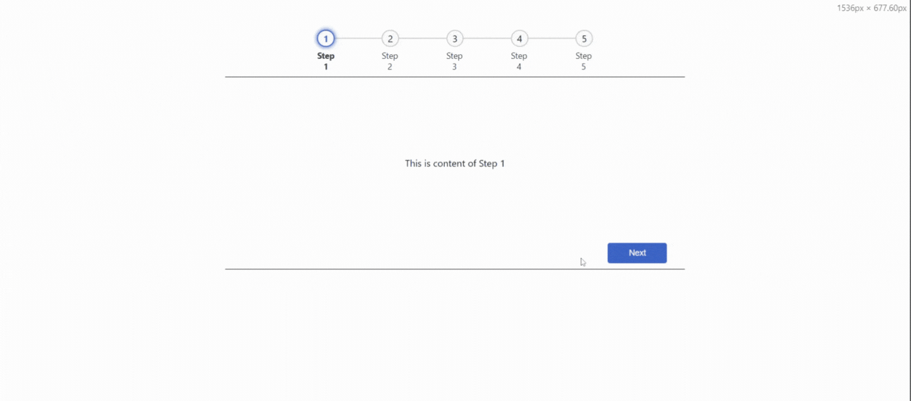

[](https://www.npmjs.com/package/react-step-navigator)

# React-Step-Navigator

React Step Navigator helps you develop powerful step progress components that _just work_ out of the box, without stopping you from customising the parts that are important to you.

Features include:

- Flexible approach to navigating forward and backward, with customisable functions
- Amazing Support for both horizontal and vertical steps 
- Dynamic and Customizable 

# Installation and usage
The easiest way to use react-step-navigator is to install it from npm and build it into your app with Webpack.
```
npm i react-step-navigator
```
or

```
yarn add react-step-navigator
```

Then use it in your app:

## Demo



```js
import React, { useState } from 'react';
import StepNavigator from 'react-step-navigator';

function App() {
  // steps to be passed to StepNavigator component
  const steps = [{
    name: "Step 1",
    content: <Component1 /> // your component for step 1
  },
  {
    name: "Step 2",
    content: <Component2 /> // your component for step 2
  },
  {
    name: "Step 3",
    content: <Component3 /> // your component for step 3
  },
  {
    name: "Step 4",
    content: <Component4 /> // your component for step 4
  },
  {
    name: "Step 5",
    content: <Component5 /> // your component for step 5
  }];

  return (
    <div className="App">
      <div>
        <StepNavigator steps={steps}/>
      </div>
    </div>
  );
}

export default App;

```

## Props

Common props you may want to specify include:

- `steps` - Steps to be created alogn with the content, which accepts the array of objects with following properties:  name, content, status, icon
- `showContent` - Flag to display the step content , content won't be displayed when it is set to false, default value is true
- `containerClassName` - Custom class name to override the stylle of outer container
- `contentClassName` - Classname to customize styles for the content of the step
- `circleClassName` - Classname to customize styles for the step circle
- `stepClassName` - Classname to customize styles for the step count
- `labelClassName` - Classname to customize styles for the step label

## Methods
React Step Navigator exposes four public methods:

- `onStepClick` - A function to handle the  click on the step circles
- `onBackClick` - A function to handle the  click on the back/previous button in the content footer
- `onNextClick` - A function to handle the  click on the next button in the content footer
- `onSubmitButtonClick` - A function to handle the  click on the Submit button in the content footer

## Customization
You can customize the react-step-progress with the help the properties annd methods which are exposed by it.

## License

MIT Licensed. Copyright (c) Udhayakumar Pandiyan @ 2024.